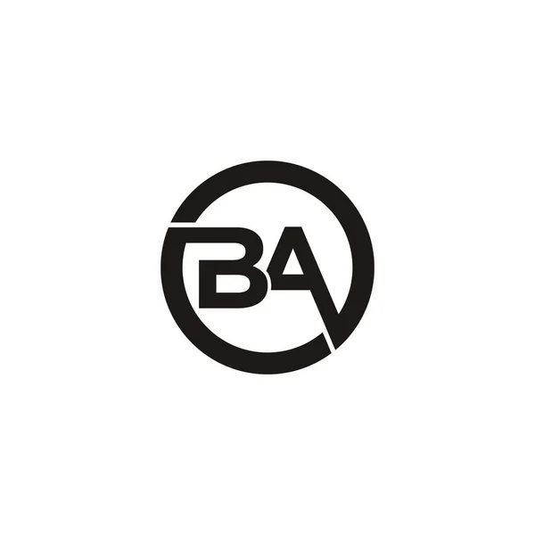

<a name="readme-top"></a>

<div align="center">
  <!-- You are encouraged to replace this logo with your own! Otherwise you can also remove it. -->
  
  <br/>

  <h3><b>README</b></h3>

</div>

<!-- TABLE OF CONTENTS -->

# 📗 Table of Contents

- [📖 About the Project](#about-project)
  - [🛠 Built With](#built-with)
    - [Tech Stack](#tech-stack)
    - [Key Features](#key-features)
  - [Screenshot](#screenshot)
  - [Loom Presentation Video](#loom-video)
  - [🚀 Live Demo](#live-demo)
- [💻 Getting Started](#getting-started)
  - [Setup](#setup)
  - [Prerequisites](#prerequisites)
  - [Install](#install)
  - [Run tests](#run-tests)
  - [Deployment](#triangular_flag_on_post-deployment)
- [👥 Authors](#authors)
- [🔭 Future Features](#future-features)
- [🤝 Contributing](#contributing)
- [⭐️ Show your support](#support)
- [🙏 Acknowledgements](#acknowledgements)
- [❓ FAQ (OPTIONAL)](#faq)
- [📝 License](#license)

<!-- PROJECT DESCRIPTION -->

# 📖 Awesome Books <a name="about-project"></a>

A website for storing and retrieving books

** [Awesome-books-ES6]** is a project(website) that Adds, removes and updates book information. the project was built using html, css, and js languages.

## 🛠 Built With <a name="built-with">HTML,CSS and Javascript</a>

### Tech Stack <a name="tech-stack"></a>

<details>
  <summary>Client</summary>
  <ul>
    <li><a href="https://en.wikipedia.org/wiki/HTML">HTML</a></li>
    <li><a href="https://www.w3.org/Style/CSS/Overview.en.html">CSS</a></li>
    <li><a href="https://www.javascript.com/">JavaScript</a></li>
  </ul>
</details>

<details>
  <summary>Server</summary>
  <ul>
    <li><a href="">N/A</a></li>
  </ul>
</details>

<details>
<summary>Database</summary>
  <ul>
    <li><a href="">N/A</a></li>
  </ul>
</details>

<!-- Features -->

### Key Features <a name="key-features"></a>

- **[HTML]**
- **[CSS]**
- **[Javascript]**

<p align="right">(<a href="#readme-top">back to top</a>)</p>

<!-- The NAMM SHOW EAST AFRICA WEBSITE SCREENSHOT -->

## 🚀 Screenshot <a name="screenshot"></a>


## 💻 Loom Presentation Video <a name="loom-video"></a>

- not available yet.

<!-- LIVE DEMO -->

## 🚀 Live Demo <a name="live-demo"></a>

- [Live Demo Link](...)

<p align="right">(<a href="#readme-top">back to top</a>)</p>

<!-- GETTING STARTED -->

## 💻 Getting Started <a name="getting-started"></a>

To get a local copy up and running, follow these steps.

### Prerequisites

In order to run this project you need:
-A Computer (MAC or PC)
-code editor (VSCode,Atom etc...)
-A browser (Chrome,Mozilla,Safari etc...)
-Version Control System (Git and Github)

### Setup

Clone this repository to your desired folder:

cd my-folder
git clone git@github.com:Besufekad-HAZ/first-capstone-project.git (SSH)

### Install

Install this project with:

npx init
npm init -y
npm install --save-dev stylelint@13.x stylelint-scss@3.x stylelint-config-standard@21.x stylelint-csstree-validator@1.x
npm install --save-dev eslint@7.x eslint-config-airbnb-base@14.x eslint-plugin-import@2.x babel-eslint@10.x

### Run tests

To run tests, run the following command:

To check Styelint error:-

npx stylelint "\*_/_.{css,scss}"

<!--
Example command:

```sh
  bin/rails test test/models/article_test.rb
```
--->

### Deployment

You can deploy this project using:
Github Pages.

<!--
Example:

```sh

```
 -->

<p align="right">(<a href="#readme-top">back to top</a>)</p>

<!-- AUTHORS -->

## 👥 Authors <a name="authors"></a>

👤 **Besufekad Alemu**

- GitHub: [@Besufekad-HAZ](https://github.com/Besufekad-HAZ)
- Twitter: [@BesufekadAlemu7](https://twitter.com/BesufekadAlemu7)
- LinkedIn: [@besura](www.linkedin.com/in/besura)

👤 **Precious Betine**

- GitHub: [@preciousbetine](https://github.com/preciousbetine)
- Twitter: [@preciousbetine](https://twitter.com/preciousbetine)
- LinkedIn: [preciousbetine](https://linkedin.com/in/preciousbetine)

<p align="right">(<a href="#readme-top">back to top</a>)</p>

<!-- FUTURE FEATURES -->

## 🔭 Future Features <a name="future-features"></a>

- [ ] **[Adding_JavaScript_Popups_and_full_functionality]**
- [ ] **[Deploying_the_page_on_github]**
- [ ] **[Adding_backend_and_databases]**

<p align="right">(<a href="#readme-top">back to top</a>)</p>

<!-- CONTRIBUTING -->

## 🤝 Contributing <a name="contributing"></a>

Contributions, issues, and feature requests are welcome!

Feel free to check the [issues page](../../issues/).

<p align="right">(<a href="#readme-top">back to top</a>)</p>

<!-- SUPPORT -->

## ⭐️ Show your support <a name="support"></a>

If you like this project rate it and give it a star.

<p align="right">(<a href="#readme-top">back to top</a>)</p>

<!-- ACKNOWLEDGEMENTS -->

## 🙏 Acknowledgments <a name="acknowledgements"></a>

--> I would like to thank the Microverse team for allowing us to work on this project.

<p align="right">(<a href="#readme-top">back to top</a>)</p>

<!-- LICENSE -->

## 📝 License <a name="license"></a>

This project is [MIT](./LICENSE) licensed.

_NOTE: we recommend using the [MIT license](https://choosealicense.com/licenses/mit/) - you can set it up quickly by [using templates available on GitHub](https://docs.github.com/en/communities/setting-up-your-project-for-healthy-contributions/adding-a-license-to-a-repository). You can also use [any other license](https://choosealicense.com/licenses/) if you wish._

<p align="right">(<a href="#readme-top">back to top</a>)</p>
